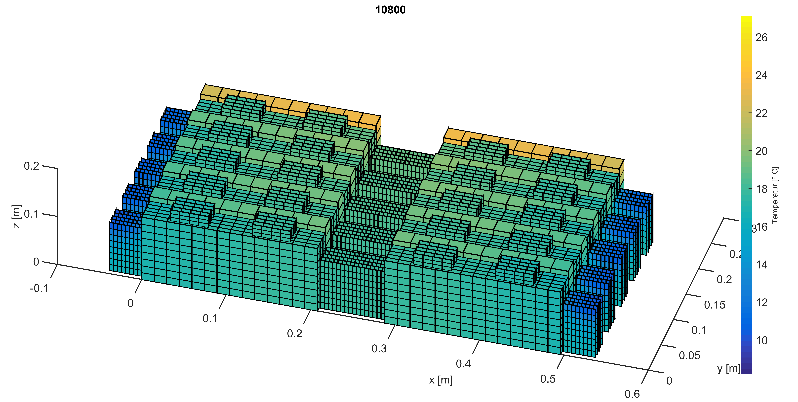

<pre>
 ___ ____  _____    _    _____
|_ _/ ___|| ____|  / \  |  ___| __ __ _ _ __ ___   ___
 | |\___ \|  _|   / _ \ | |_ | '__/ _` | '_ ` _ \ / _ \
 | | ___) | |___ / ___ \|  _|| | | (_| | | | | | |  __/
|___|____/|_____/_/   \_\_|  |_|  \__,_|_| |_| |_|\___|
</pre>

<div align=right>
<a href="http://www.isea.rwth-aachen.de/">   </a>
</div>

About ISEAFrame
==============================
The <a href=http://www.isea.rwth-aachen.de/>ISEA</a> Battery Framework is a real time capable simulation framework  written in C++. It allows coupled electrical-thermal simulations of single storage systems (e.g. lithium ion batteries or double layer capacitors) or complete storage system packs. These packs may consist of arbitrary but reasonable series and parallel connections of single storage systems. The electrical simulations are based on impedance based modeling, the thermal simulations on the finite volume method (FVM).
The simulation framework can be used for the following purposes:
+ Development and testing of battery management systems (BMS). Particularly it is possible to investigate the BMS behavior in an error case of the storage system (e.g. short circuits or thermal issues).
+ Dimensioning, development and testing of storage system packs. I.e. it is possible to evaluate and optimize pack geometry, electrical and thermal topologies as well as optimized cooling properties for a storage system pack for given requirements.
+ Since the simulation framework is real time capable it can be implemented on a Hardware in the loop platform (HIL) to estimate crucial states of storage system packs used in electric vehicles (e.g. state of charge, state of health, state of function). A quick and accurate parameterization of the implemented model can be achieved by electrochemical impedance spectroscopy (EIS) and time domain measurements (TDM).


For electrical parameter identification the [FittingGUI](https://github.com/HWitz/FittingGUI ) is suggested.
The author of the FittingGUI worked very close with the development team for implementation of electrical equivalent circuits.





Required Software:
==============================
+ eigen3 (3.3.2)
+ armadillo (4.300,9)
+ boost (1_58)
+ matio (1.5.2)

Compiling under Linux (debian)
==============================
<pre>
apt-get install libeigen3-dev libarmadillo-dev libarmadillo6 libboost1.58-all-dev libmatio4 libmatio-dev cmake ccmake build-essentials gcc-4.9
</pre>

+ change to /usr/include/eigen/
+ apply patch (e.g. patch -p2 < patches/eigen/eigen3_SparseMatrix.patch)
+ mkdir build
+ cd build
+ ccmake ..
+ check options for compiling
+ make
+ make doc

Building under Unix
============

```bash
mkdir build
cd build
ccmake ..
make
make doc
```

Compiling under windows
==============================
Additional needed Software:
Visual Studio 2015

Download needed software
patch eigen as stated above

+ run cmake
+ set builddirectory
+ push configure
+ Set archtype to 64 or 32 depending on your architecture
+ Set USE_STRING_AND_STREAMS
+ if bost or matio are not found automatically add them manually under the advanced option
+ configure once more and generate
+ After generating open project with visual studio and compile project

An longer description can be found [here](doxygen/buildingUnderWindows.md).

Documentation
=========
A developer version and a user version of the documentation is available.
The user documentation can be build with doxygen by using "Doxyfile_release.in".
The other one can be build as described by running 
<pre>
make doc 
</pre>

Featured Projects
=================
Parts of the framework are used in the following projects:
1. Toolbox Speichersysteme, Energy Storage Toolbox 
  * Förderkennzeichen: 64.65.69-EM-2011A

2. Offenes Batterie-Alterungs-Tool zur Lebensdauerprognose von Batteriepacks unter Berücksichtigung von Unsicherheiten und Streuung von Zellqualität,
  * Website: [openbat](https://openbat.de)
  * Förderkennzeichen: 0325905

Authors
===========
Please acknowledge the [authors](DevelopmentTeam.md).

License
=========
The ISEA-Framework is published under the GNU General Public License version 3.
For commercial use, a different license is available.
Further information can be requested at post@isea.rwth-aachen.de .

More information can be found [here](LICENSE.MD).


